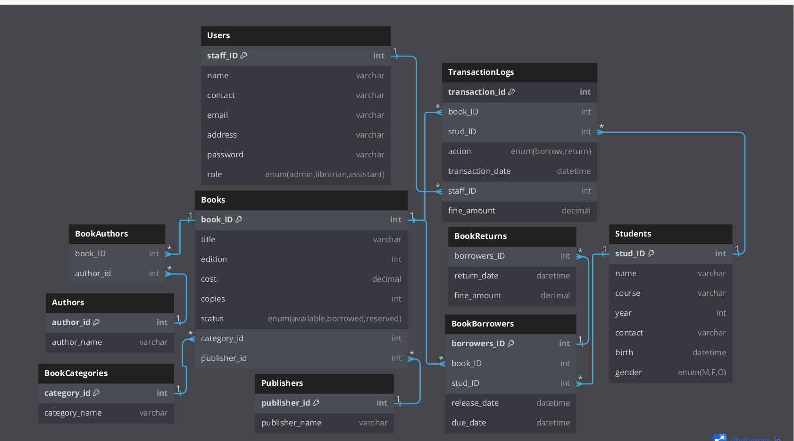

## Library Managements System

This project is about school library management system

## ER diagram of Library Management System

https://dbdiagram.io/d/library-67238d35b1b39dd858155c37

### Features:

Student features:

- Can register their account and borrow and return book
- Can view the borrowed books, fined amount if they have not returned book
- Can view issued date, book returned date
- Can view all the book list including their categories, quantity, author name.
- Can easily search books using book name.

Admin features:

- Can add, delete and update books and it's details.
- Can add and remove users.
